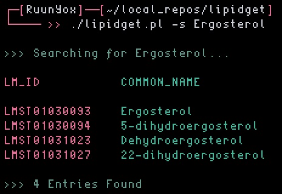

# lipidget
### Commandline access to the LipidMaps structure and properties database.

---

<p align="center">

<p/>

See -h flag for usage:
```
 << LIPIDGET >>

 Usage: lipidget [opts] [str or LMID]

	-s [str]         search the LipidMaps database
	--csv [LMID]	 save fetch to csv format
	--mol [LMID]	 save fetch to mol format
	--sdf [LMID]	 save fetch to sdf format
```

